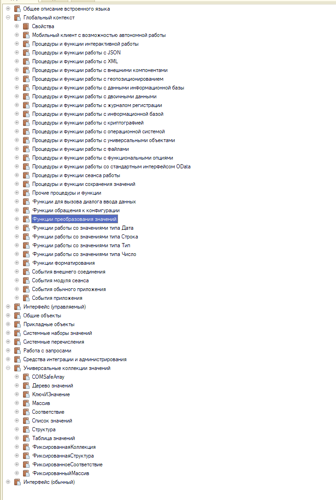

# Технический маршрут: первый базис

Дата: 2026-07-24.

Платформа 1С уже установлена. Дальше идем по приведенному порядку. Справочные ссылки в конце — это места, куда нужно подсматривать по ходу работы, а не отдельные этапы.

## В первую очередь: рабочее место

### 1. Настроить конфигуратор

Пройди настройки по статье: <https://infostart.ru/1c/articles/2192029/>.

Цель — подготовить конфигуратор к ежедневной работе: удобное чтение кода, навигация и отображение нужной служебной информации.

### 2. Осваивать все горячие клавиши

Полный перечень: <https://its.1c.ru/db/v8std/content/430/hdoc>.

Задача — со временем освоить **все сочетания из перечня**, а не выбрать ограниченный список. Садиться и заучивать весь перечень за один раз не нужно.

Рабочий подход:

- сначала просмотри весь перечень и узнай, какие действия доступны с клавиатуры;
- осваивай сочетания группами и сразу применяй их в работе;
- если часто повторяешь действие мышью, проверь, есть ли для него горячая клавиша;
- сознательно заменяй привычное действие мышью на сочетание клавиш;
- регулярно возвращайся к полному перечню и добавляй следующие сочетания.

Это постоянная практика. Она экономит очень много времени и постепенно перестраивает сам способ работы в конфигураторе.

### 3. Установить KDiff3

Сайт: <https://kdiff3.sourceforge.net/>.

Установи программу, запусти ее и проверь сравнение двух файлов или двух каталогов. Дальше будем закреплять ее на реальных изменениях.

## Во вторую очередь: базис

### Как открыть синтакс-помощник

В конфигураторе нажми `Ctrl+F1`. Откроется синтакс-помощник. Нужные разделы выбираются в дереве в левой части окна.

Ветка `COMSafeArray`, видимая на скриншоте, в текущий маршрут не входит — ее пропускаем.

### 1. Типы и коллекции

Последовательно разберись:

1. с типами значений в 1С;
2. с типами коллекций;
3. с веткой `Универсальные коллекции значений` в синтакс-помощнике.

В ветке `Универсальные коллекции значений` пройди следующие разделы:

- `Дерево значений`;
- `КлючИЗначение`;
- `Массив`;
- `Соответствие`;
- `Список значений`;
- `Структура`;
- `Таблица значений`;
- `ФиксированнаяКоллекция`;
- `ФиксированнаяСтруктура`;
- `ФиксированноеСоответствие`;
- `ФиксированныйМассив`.

Каждый узел нужно раскрыть. Посмотри назначение типа, способы его создания, свойства, методы, параметры методов и возвращаемые значения. Важно не просто прочитать названия, а понять, какую коллекцию и почему выбирать для конкретной задачи.

После синтакс-помощника закрепи тему статьей: <https://xn----1-bedvffifm4g.xn--p1ai/articles/%D1%80%D0%B0%D0%B1%D0%BE%D1%82%D0%B0-%D1%81-%D1%83%D0%BD%D0%B8%D0%B2%D0%B5%D1%80%D1%81%D0%B0%D0%BB%D1%8C%D0%BD%D1%8B%D0%BC%D0%B8-%D0%BA%D0%BE%D0%BB%D0%BB%D0%B5%D0%BA%D1%86%D0%B8%D1%8F%D0%BC%D0%B8/>.

Нужно уметь определить тип значения, выбрать подходящую коллекцию для задачи и объяснить свой выбор.

### 2. Глобальный контекст

В синтакс-помощнике (`Ctrl+F1`) раскрой ветку `Глобальный контекст` и последовательно пройди:

1. `Функции преобразования значений`;
2. `Функции работы со значениями типа Дата`;
3. `Функции работы со значениями типа Строка`;
4. `Функции работы со значениями типа Тип`;
5. `Функции работы со значениями типа Число`.

В каждом разделе пройди все функции: прочитай назначение, синтаксис, параметры, возвращаемое значение и примеры. Основные функции сразу проверь короткими вызовами в учебном коде.

Важно научиться находить нужную функцию в синтакс-помощнике, читать ее параметры, ограничения и пример, а не просто запоминать названия.

### 3. Алгоритмы и код

После типов, коллекций и глобального контекста начнутся небольшие практические задачи. Сначала они будут закреплять пройденные темы, затем добавятся самостоятельные алгоритмы — например, распределение суммы пропорционально коэффициентам.

Комплект заданий: [Практические задачи: типы, коллекции и алгоритмы](alexey-tasks-types-collections-algorithms.md).

Задачи выполняются сериями по указанию наставника: обязательный минимум, основной уровень, самостоятельные алгоритмы и максимум. Весь комплект сразу решать не нужно.

Для каждой задачи:

1. сначала опиши алгоритм словами;
2. затем напиши код;
3. подготовь тесты и граничные случаи;
4. объясни, почему выбраны именно эти типы и коллекции.

### 4. Запросы

Основной материал: <https://its.1c.ru/db/pubqlang>.

Язык запросов разбираем подробно: в этой теме нет мелочей. Нужно пройти материал целиком и выписать **все синтаксические структуры** в собственный структурированный конспект.

Практику запросов начнем отдельно, когда будет готова учебная песочница 1С.

## После базиса

Начнем подготовку к `1С:Профессионал` и продолжим изучать механизмы платформы через практические задачи.

## Куда подсматривать

Эти источники сопровождают работу, но не являются отдельными этапами:

- по общим вопросам разработки — практическое пособие разработчика: <https://its.1c.ru/db/pubdevguide83>;
- по метаданным — руководство разработчика: <https://its.1c.ru/db/v8327doc#bookmark:dev:TI000000020>.

Материалы на будущее:

- БСП: <https://its.1c.ru/db/bsp321doc>
- учебные задачи от 1С: <https://its.1c.ru/db/pubv8problems#content:1:hdoc>
